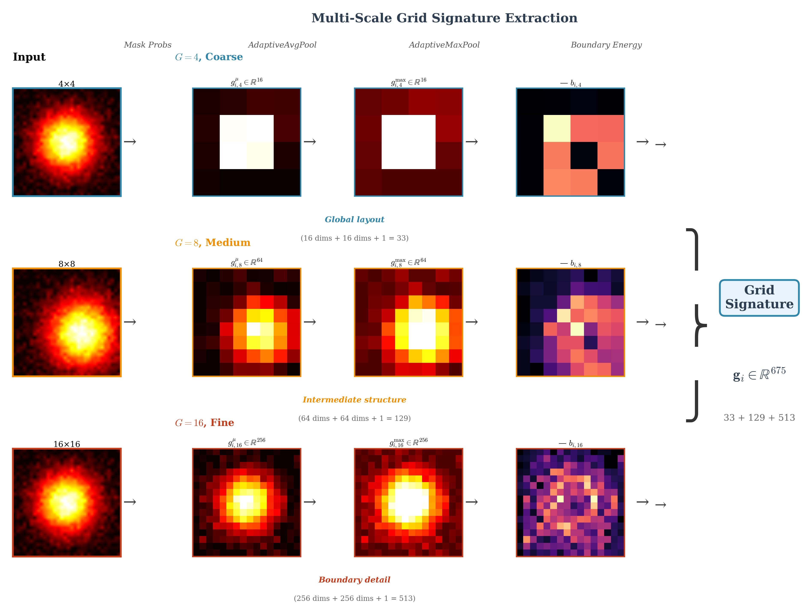
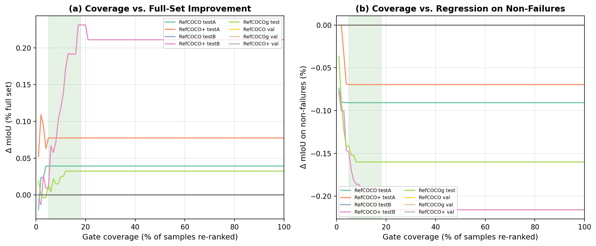

<div align="center">


<h1>Venice-H1</h1>
<h3>Failure-Aware Query Re-Ranking with Multi-Scale Grid Signatures<br>for Referring Image Segmentation</h3>

<p>
  <a href="https://arxiv.org/abs/2506.XXXXX"></a>
  <a href="https://huggingface.co/OdaxAI/venice-h1"></a>
  <a href="LICENSE"></a>
  <a href="https://www.python.org/"></a>
  <a href="https://pytorch.org/"></a>
</p>

<p>
  <b>Nicolò Savioli, Ph.D.</b><br>
  <a href="https://odaxai.com">OdaxAI Research</a> · nicolo.savioli@odaxai.com
</p>

</div>

---

> Modern RIS systems generate N candidate masks but rely on a detection-score heuristic to select the final one. In **7–18% of samples** this choice is wrong — and these failures drive **40–68% of total segmentation error**. Venice-H1 detects and corrects these failures with only ~11M additional parameters and <1 ms latency.

---

## Architecture Overview

<div align="center">

</div>

<p align="center"><em>Venice-H1 pipeline. A frozen DeRIS backbone (left) generates N=10 candidate masks. Multi-scale grid signatures (center) encode spatial quality. The Failure Re-Ranker (right) gates intervention: it only overrides Query-0 when confident the default choice is wrong.</em></p>

---

## The Failure-Case Bottleneck

<div align="center">
<table>
<tr>
<td width="50%"></td>
<td width="50%"></td>
</tr>
<tr>
<td align="center"><em>7–18% of samples (red) generate 40–68% of total error. A better query exists.</em></td>
<td align="center"><em>Failure cases form a "triangle of opportunity": low default IoU, high best-query IoU.</em></td>
</tr>
</table>
</div>

---

## Multi-Scale Grid Signatures

<div align="center">

</div>

<p align="center"><em>From mask probability P_i, we compute grid signatures at 4×4 (coarse), 8×8 (medium), 16×16 (fine). Each scale captures complementary spatial structure. Combined: <b>675-dim descriptor</b> per candidate.</em></p>

<div align="center">

</div>

<p align="center"><em>Multi-scale grid cells inspired by entorhinal cortex representations. Coarse grids capture global layout, fine grids encode boundary quality.</em></p>

---

## Results

### Full dataset (RefCOCO/+/g, DeRIS-L backbone)

| Split | Failure Rate | Q0 mIoU | Venice-H1 | Δ | Gate AUC |
|---|---|---|---|---|---|
| RefCOCO val | 6.8% | 86.47 | 86.51 | **+0.04** | 0.78 |
| RefCOCO testA | 6.2% | 88.09 | 88.18 | **+0.09** | — |
| RefCOCO testB | 9.4% | 81.63 | 81.82 | **+0.19** | — |
| RefCOCO+ val | 9.3% | 73.46 | 73.60 | **+0.14** | — |
| RefCOCOg val | 11.7% | 69.53 | 69.84 | **+0.31** | — |

### On failure cases only

| Metric | Value |
|---|---|
| Δ_fail (mIoU improvement) | **+1.824** |
| Harmful-switch rate | **< 0.6%** |
| AUC (failure detection) | **0.778** |

<div align="center">

</div>

<p align="center"><em>Per-split improvement bars: Venice-H1 yields positive Δ across all 8 evaluation splits.</em></p>

---

## Failure Gate & ROC Analysis

<div align="center">
<table>
<tr>
<td width="50%"></td>
<td width="50%"></td>
</tr>
<tr>
<td align="center"><em>ROC curves for the Failure Gate across splits. AUC 0.78–0.82.</em></td>
<td align="center"><em>Coverage-risk trade-off: the gate maintains low harmful-switch rate across all τ.</em></td>
</tr>
</table>
</div>

---

## Qualitative Results

<div align="center">

</div>

<p align="center"><em>Qualitative re-ranking on RefCOCO val. Each row: input, ground truth, default query (red, fails), Venice-H1 corrected selection (blue). In all cases, Venice-H1 recovers IoU > 84%.</em></p>

---

## Medical Cross-Domain Transfer

<div align="center">

</div>

<p align="center"><em>Zero-shot transfer to medical RIS: MS-CXR (+1.16 mIoU) and M3D-RefSeg-2D (+0.51 mIoU) without domain-specific fine-tuning.</em></p>

---

## Ablation Study

<div align="center">

</div>

| Configuration | ∆_fail | Gate AUC |
|---|---|---|
| BASE only (no grid) | +1.01 | 0.812 |
| 4×4 grid only | +1.01 | 0.821 |
| 8×8 grid only | +0.87 | 0.790 |
| 16×16 grid only | +1.00 | 0.828 |
| **BASE + all grids (ours)** | **+1.22** | **0.807** |

---

## Reproduce Paper Results

You need: a CUDA-capable GPU, DeRIS-L weights, and RefCOCO data.

### Step 0 — Install

```bash
git clone https://github.com/odaxai/Venice-H1.git
cd Venice-H1
pip install -r requirements.txt
pip install -e .
```

### Step 1 — Download the base model (DeRIS-L)

Venice-H1 is a **post-hoc re-ranker on top of DeRIS-L**. You need DeRIS-L to extract features.

```bash
# Clone DeRIS repository
git clone https://github.com/kkb-src/DeRIS.git

# Download DeRIS-L checkpoint from their official release
# See https://github.com/kkb-src/DeRIS for the link
# Expected: checkpoints/deris_l.pth (~750MB)
```

### Step 2 — Download Venice-H1 checkpoint

```python
from huggingface_hub import hf_hub_download
path = hf_hub_download(repo_id="OdaxAI/venice-h1", filename="venice_h1_deris_l.pt")
print("Saved to:", path)
```

Or download from [🤗 OdaxAI/venice-h1](https://huggingface.co/OdaxAI/venice-h1).

### Step 3 — Verify checkpoint (no GPU needed)

```bash
python reproduce_results.py --verify_only
```

```
── Architecture Verification ──────────────────
  Parameters : 11,296,258  ✓ MATCH

── Paper Cross-Check (RefCOCO val) ─────────────
  ✓ delta_fail : 1.8244  (paper: 1.824)
  ✓ auc_fail   : 0.7776  (paper: 0.778)
  ✓ delta_full : 0.0392  (paper: 0.039)
```

### Step 4 — Extract features from DeRIS-L

```bash
python scripts/extract_features.py \
    --deris_checkpoint checkpoints/deris_l.pth \
    --data_root data/refcoco/ \
    --dataset refcoco --split val \
    --output data/
```

### Step 5 — Full evaluation

```bash
python reproduce_results.py --features_dir data/ --splits all
```

### Step 6 — Train from scratch (~3 min)

```bash
python train.py \
    --config venice_h1/configs/default.yaml \
    --train_cache data/cached_train_feats.pt \
    --val_cache data/cached_val_refcoco_unc_feats.pt
```

---

## Quick Inference (Python API)

```python
import torch
from huggingface_hub import hf_hub_download
from venice_h1.model.reranker import VeniceH1Reranker

ckpt_path = hf_hub_download(repo_id="OdaxAI/venice-h1", filename="venice_h1_deris_l.pt")
ckpt = torch.load(ckpt_path, map_location="cpu", weights_only=False)
cfg = ckpt["config"]

model = VeniceH1Reranker(
    query_feat_dim=cfg["query_feat_dim"],
    hidden_dim=cfg["hidden_dim"],
    n_layers=cfg["n_layers"],
    n_heads=cfg["n_heads"],
    tau=cfg["tau"],
)
model.load_state_dict(ckpt["model"], strict=False)
model.eval()

# features: (B, N=10, 936) from scripts/extract_features.py
with torch.no_grad():
    out = model(features, det_scores, mask_means)
    selected = model.rerank(features, det_scores, mask_means)
```

---

## Architecture Diagram

```
Input: Image I, expression e, threshold τ
─────────────────────────────────────────────────────────
Step 1  Frozen DeRIS-L (external, not included)
        {q_i, M_i, s_i}^{N-1}_{i=0} = DeRIS(I, e)

Step 2  Feature assembly (offline, once)
        P_i = sigmoid(M_i)
        g_i = MultiScaleGridSignatures(P_i)  ← 675 dim
        f_i = [q_i; s_i; μ_i; σ_i; a_i; g_i]  ∈ R^{936}

Step 3  Venice-H1 Re-Ranker (11.3M params)
        ┌──────────────────────────────────────────────┐
        │  QueryEncoder: 2-layer MLP → R^{512}         │
        │  Transformer:  L=3, A=8, pre-norm GELU       │
        │    ├── Failure Gate  →  P_fail ∈ [0,1]       │
        │    └── Gain Predictor→  ĝ_i  ∈ R             │
        └──────────────────────────────────────────────┘

Step 4  Gated selection
        if P_fail > τ:   i* = argmax_i ĝ_i
        else:            i* = 0   (retain Query-0)

Output: mask P_{i*}
─────────────────────────────────────────────────────────
~11.3M parameters · <1 ms overhead
```

---

## Docker

```bash
docker build -t venice-h1 .
docker run --gpus all -v /path/to/data:/workspace/data \
    venice-h1 python reproduce_results.py --verify_only
```

---

## Repository Structure

```
Venice-H1/
├── venice_h1/
│   ├── model/
│   │   ├── grid_signatures.py     # Multi-Scale Grid Signatures (Sec 3.3)
│   │   └── reranker.py            # Failure Gate + Gain Predictor (Sec 3.4)
│   └── configs/
│       └── default.yaml           # Exact paper hyperparameters
├── scripts/
│   └── extract_features.py        # Feature extraction from DeRIS-L
├── reproduce_results.py           # ← ONE-COMMAND paper reproduction
├── train.py                       # Training loop
├── evaluate.py                    # Full evaluation
├── Dockerfile
├── requirements.txt
└── assets/                        # Paper figures
```

---

## Citation

```bibtex
@article{savioli2026veniceh1,
  title     = {Venice-H1: Failure-Aware Query Re-Ranking with Multi-Scale
               Grid Signatures for Referring Image Segmentation},
  author    = {Savioli, Nicol{\`o}},
  journal   = {arXiv preprint arXiv:2506.XXXXX},
  year      = {2026},
  note      = {OdaxAI Research}
}
```

---

## License

MIT License — see [LICENSE](LICENSE) for details.

---

<div align="center">
<sub><a href="https://odaxai.com">OdaxAI Research</a> · 2026</sub>
</div>
