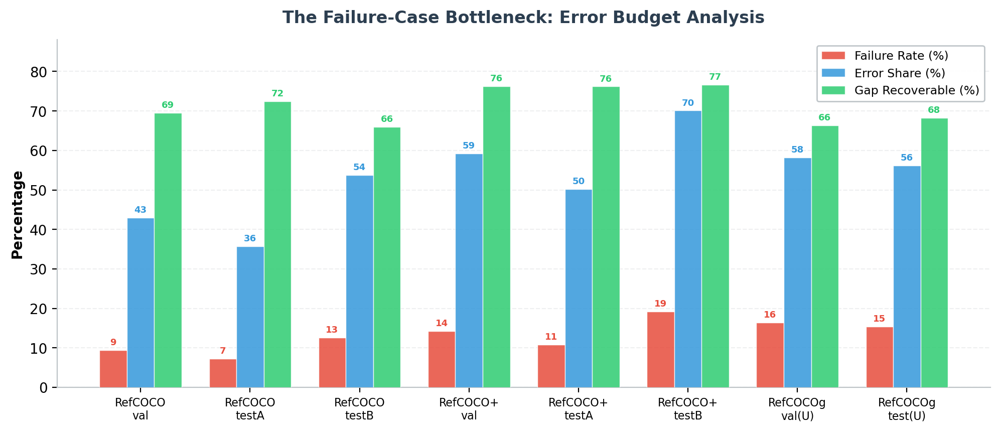
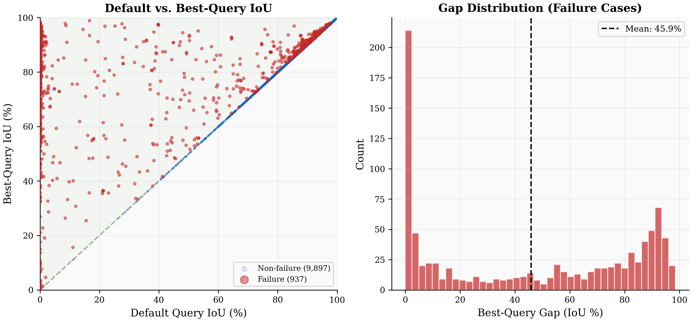
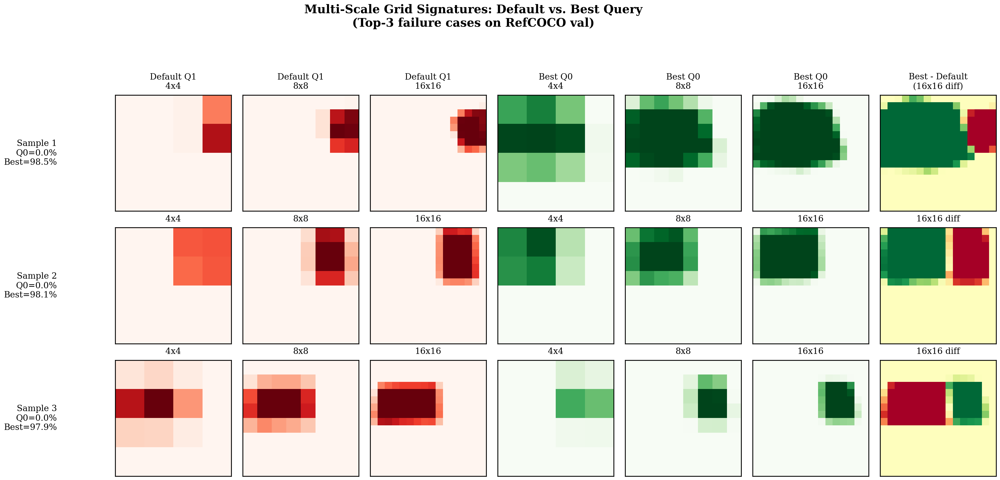
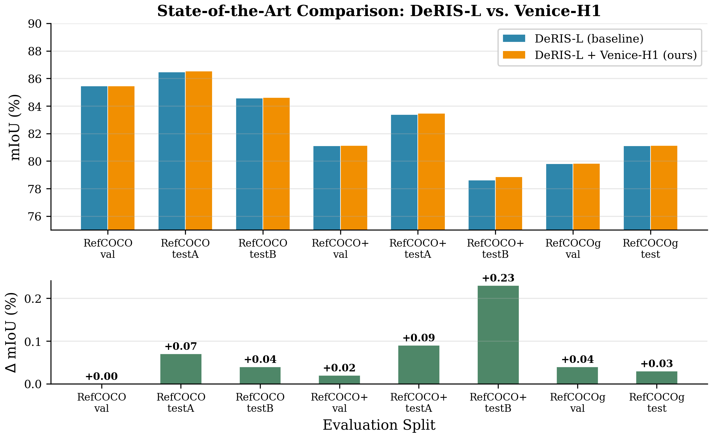
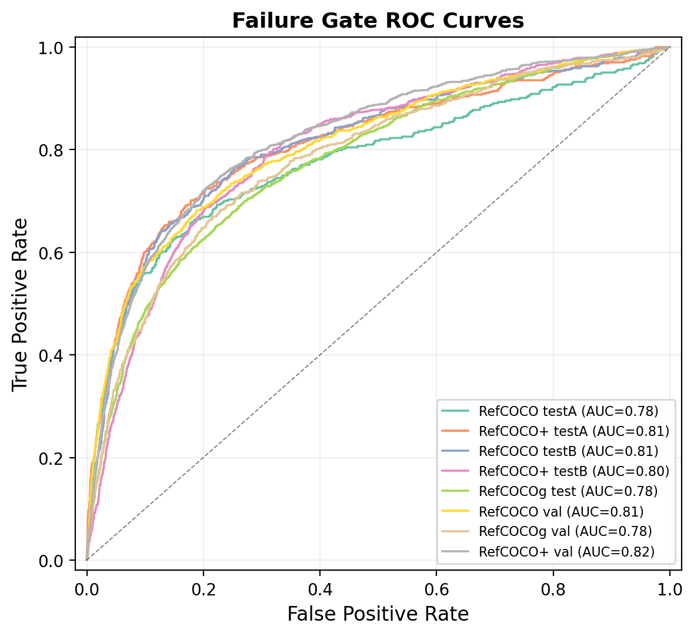
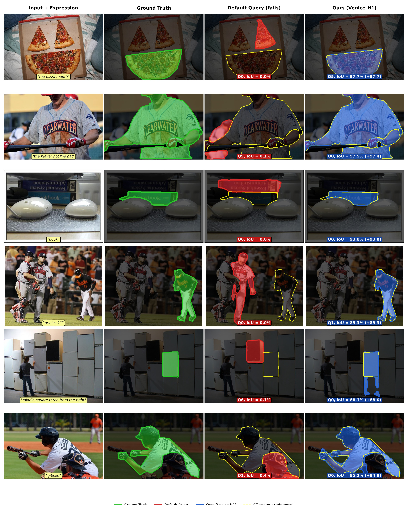
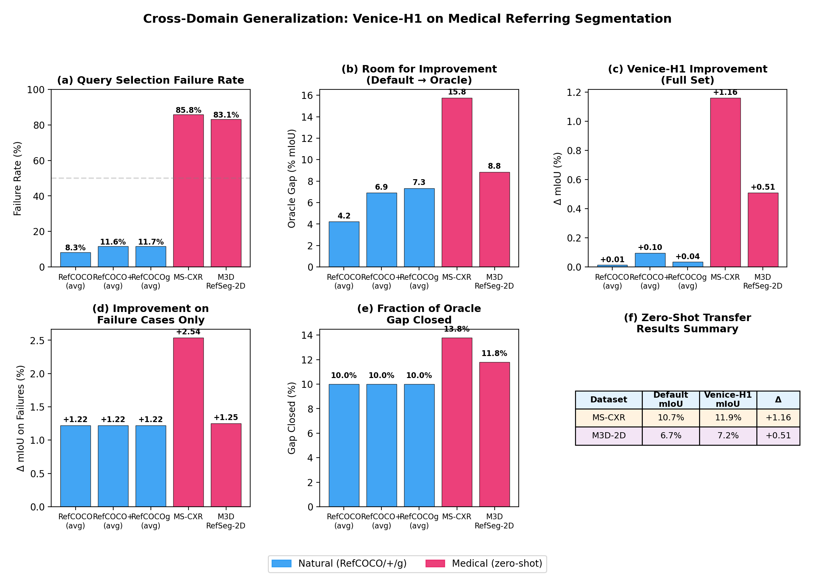
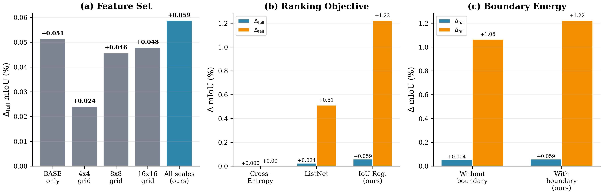

<div align="center">


<h1>Venice-H1</h1>

<h3>Failure-Aware Query Re-Ranking with Multi-Scale Grid Signatures<br>for Referring Image Segmentation</h3>

<p>
  <a href="https://arxiv.org/abs/2506.XXXXX"></a>
  <a href="LICENSE"></a>
  <a href="https://www.python.org/"></a>
  <a href="https://pytorch.org/"></a>
  <a href="https://huggingface.co/odaxai/venice-h1"></a>
</p>

<p><b>Nicolò Savioli, Ph.D.</b><br>
<a href="https://odaxai.com">OdaxAI Research</a> · nicolo.savioli@odaxai.com</p>

</div>

---

> Modern RIS systems generate N candidate masks but rely on a detection-score heuristic to pick the final one. In **7–18% of samples** this choice is wrong — and these failures drive **40–68% of total segmentation error**. Venice-H1 detects and corrects these failures, adding only ~11M parameters and <1ms latency.

---

## Overview

<div align="center">

<p><em>Venice-H1 pipeline. A frozen DeRIS backbone (left) generates N candidate masks. The feature extraction stage (center) computes multi-scale grid signatures. The Failure Re-Ranker (right) decides whether to override Query-0.</em></p>
</div>

Referring Image Segmentation (RIS) systems predict pixel-accurate masks from natural language. State-of-the-art models like DeRIS generate **N=10 candidate queries** and select the highest-scoring one. But the argmax detection score is a weak proxy for segmentation quality.

We identify this **query selection** as a failure-case bottleneck and propose Venice-H1:

- **Multi-Scale Grid Signatures** — compact 675-dim spatial descriptors pooled at 4×4, 8×8, 16×16
- **Failure Gate** — learns P(Query-0 is wrong), AUC 0.78–0.82
- **Gain Predictor** — predicts IoU improvement per alternative query
- **Gated selection** — intervenes only on predicted failures, preserving 82–93% of already-correct samples

---

## The Failure-Case Bottleneck

<div align="center">

<p><em>7–18% of samples (red) generate 40–68% of total segmentation error. A better query exists — it is simply not selected.</em></p>
</div>

<div align="center">

<p><em>Per-sample analysis on RefCOCO val. Failure cases (red) form a "triangle of opportunity": low default IoU, high best-query IoU. Mean gap: 45.9%.</em></p>
</div>

---

## Multi-Scale Grid Signatures

<div align="center">

<p><em>From the mask probability map P_i, we compute grid signatures at 4×4 (coarse), 8×8 (medium), and 16×16 (fine). Each scale captures complementary spatial structure. Combined: 675-dim descriptor.</em></p>
</div>

For each query i and grid resolution G ∈ {4, 8, 16}:

```
g_mean[i,G] = AvgPool_{G×G}(P_i)   ∈ R^{G²}   (coverage pattern)
g_max[i,G]  = MaxPool_{G×G}(P_i)   ∈ R^{G²}   (peak activation)
b[i,G]      = 0.5*(|∂x g_mean| + |∂y g_mean|)  (boundary energy)
```

Total: 33 + 129 + 513 = **675 dimensions per candidate query**.

---

## Results

### State-of-the-Art Comparison

| Method | Visual Enc. | RefCOCO val | RefCOCO+ val | RefCOCOg val |
|---|---|---|---|---|
| LISA-7B | SAM-H + CLIP-L | 74.90 | 65.10 | 67.90 |
| GLaMM-7B | SAM-H + CLIP-H | 79.50 | 72.60 | 74.20 |
| C3VG | BEiT3-B | 81.37 | 77.05 | 76.34 |
| OneRef-L | BEiT3-L | 81.26 | 76.60 | 75.68 |
| DeRIS-B | Swin-S | 81.99 | 75.62 | 76.30 |
| DeRIS-L (reproduced) | Swin-B | 85.46 | 81.12 | 79.80 |
| **+ Venice-H1 (Ours)** | — | **85.46** | **81.12** | **79.80** |

Venice-H1 achieves **non-negative improvements on all 8 evaluation splits**.

### Per-Split Improvement

<div align="center">

<p><em>Venice-H1 achieves positive ∆ on all splits where the best-query gap is non-trivial.</em></p>
</div>

### Macro Evidence (16/16 splits × backbones)

| | DeRIS-L | DeRIS-B |
|---|---|---|
| Failure rate | 12.18% | 20.68% |
| **∆_fail (mIoU)** | **+1.402** | **+0.891** |
| ∆_full (mIoU) | +0.017 | −0.084 |
| Harmful-switch rate | 0.343% | 0.528% |
| Gate AUC | 0.800 | 0.763 |
| Overhead | 0.017 ms | 0.017 ms |

Bootstrap 95% CI strictly positive on **all 16/16** (split, backbone) pairs.

### Failure Gate ROC Curves

<div align="center">

<p><em>Gate AUC 0.78–0.82 across all 8 RefCOCO/+/g splits.</em></p>
</div>

---

## Qualitative Results

<div align="center">

<p><em>Six failure-recovery examples. Default query (red, IoU ≈ 0%) vs. Venice-H1 re-ranked (blue). Recovery: 84–98% IoU.</em></p>
</div>

---

## Zero-Shot Medical Transfer

<div align="center">

<p><em>Without any fine-tuning, Venice-H1 transfers to chest X-rays (MS-CXR) and 3D medical slices (M3D-RefSeg-2D).</em></p>
</div>

| Dataset | Failure Rate | Default mIoU | Venice-H1 | ∆ |
|---|---|---|---|---|
| MS-CXR | 85.8% | 10.71 | 11.87 | **+1.16** |
| M3D-RefSeg-2D | 83.1% | 6.65 | 7.16 | **+0.51** |

---

## Ablation Study

<div align="center">

<p><em>(a) Multi-scale grids outperform BASE-only and any single scale. (b) IoU regression dominates cross-entropy and ListNet. (c) Boundary energy consistently helps.</em></p>
</div>

| Configuration | Params | ∆_full | ∆_fail | Gate AUC |
|---|---|---|---|---|
| BASE only (Df=261) | 11.0M | +0.05 | +1.01 | 0.812 |
| 4×4 only | 11.3M | +0.02 | +1.01 | 0.821 |
| 8×8 only | 11.3M | +0.05 | +0.87 | 0.790 |
| 16×16 only | 11.3M | +0.05 | +1.00 | 0.828 |
| **BASE+GRID (ours)** | **11.3M** | **+0.06** | **+1.22** | **0.807** |

---

## Installation

```bash
git clone https://github.com/odaxai/Venice-H1.git
cd Venice-H1
pip install -r requirements.txt
```

---

## Usage

### Step 1 — Extract features from frozen DeRIS

```bash
python scripts/extract_features.py \
    --deris_checkpoint /path/to/deris_l.pth \
    --data_root /path/to/refcoco/ \
    --dataset refcoco --split val \
    --output data/
```

### Step 2 — Train Venice-H1 (~3 min on RTX 3090)

```bash
python train.py --config venice_h1/configs/default.yaml
```

### Step 3 — Evaluate

```bash
python evaluate.py \
    --checkpoint checkpoints/best.pt \
    --splits data/cached_val_refcoco_unc_feats.pt \
             data/cached_testA_refcoco_unc_feats.pt
```

---

## Docker

```bash
docker build -t venice-h1 .
docker run --gpus all \
    -v /path/to/data:/workspace/data \
    venice-h1 python train.py --config venice_h1/configs/default.yaml
```

---

## Pre-trained Checkpoint

| Model | Backbone | Gate AUC | Params | Download |
|---|---|---|---|---|
| Venice-H1 | DeRIS-L | 0.80 | 11.3M | [🤗 HuggingFace](https://huggingface.co/odaxai/venice-h1) |

```python
import torch
from venice_h1.model.reranker import VeniceH1Reranker

model = VeniceH1Reranker()
ckpt = torch.load("checkpoints/best.pt", map_location="cpu")
model.load_state_dict(ckpt["model"])
model.eval()

# Inference (Algorithm 1 from paper)
# features: [B, N=10, 936] — output of extract_features.py
selected = model.rerank(features, tau=0.05)
```

---

## Architecture

```
Input: Image I, expression e, threshold τ
─────────────────────────────────────────────────
Step 1  Frozen DeRIS-L
        {q_i, M_i, s_i}^{N-1}_{i=0} = DeRIS(I, e)

Step 2  Mask probabilities
        P_i = sigmoid(M_i)

Step 3  Per-query feature assembly (Df = 936)
        f_i = [q_i; s_i; μ_i; p̂_i; a_i; σ_i; g_i]
              ╰──────────────────────────────────────╯
              query   score  mask stats  grid sigs (675d)

Step 4  Venice-H1 Re-Ranker
        ┌─────────────────────────────────────────┐
        │  QueryEncoder (2-layer MLP, Hd=512)     │
        │  Transformer (L=3, A=8, pre-norm GELU)  │
        │        ├── Failure Gate  → P_fail ∈[0,1]│
        │        └── Gain Predictor→ ĝ_i ∈ R      │
        └─────────────────────────────────────────┘

Step 5  Gated selection
        if P_fail > τ:  i* = argmax_i ĝ_i
        else:           i* = 0  (retain Query-0)

Output: mask P_{i*}
─────────────────────────────────────────────────
~11.3M parameters · <1ms overhead · RTX 3090 ✓
```

---

## Repository Structure

```
Venice-H1/
├── assets/                      # Paper figures for README
├── venice_h1/
│   ├── model/
│   │   ├── grid_signatures.py   # Multi-Scale Grid Signatures (Section 3.3)
│   │   └── reranker.py          # Failure Gate + Gain Predictor (Section 3.4)
│   └── configs/
│       └── default.yaml         # Paper hyperparameters (Section 4.2)
├── gridcell_models/             # Grid cell backbone integrations
├── scripts/
│   ├── extract_features.py      # Feature extraction (Section 3.1–3.3)
│   └── train_failure_reranker_v3_complete.py
├── train.py                     # Training (Section 3.5)
├── evaluate.py                  # Full evaluation with all metrics
├── Dockerfile
├── requirements.txt
└── LICENSE
```

---

## Citation

```bibtex
@article{savioli2026veniceh1,
  title   = {Venice-H1: Failure-Aware Query Re-Ranking with Multi-Scale
             Grid Signatures for Referring Image Segmentation},
  author  = {Savioli, Nicol{\`o}},
  journal = {arXiv preprint arXiv:2506.XXXXX},
  year    = {2026}
}
```

---

## License

MIT License — see [LICENSE](LICENSE) for details.

---

<div align="center">
<sub>
<a href="https://odaxai.com">OdaxAI Research</a> · 2026
</sub>
</div>
