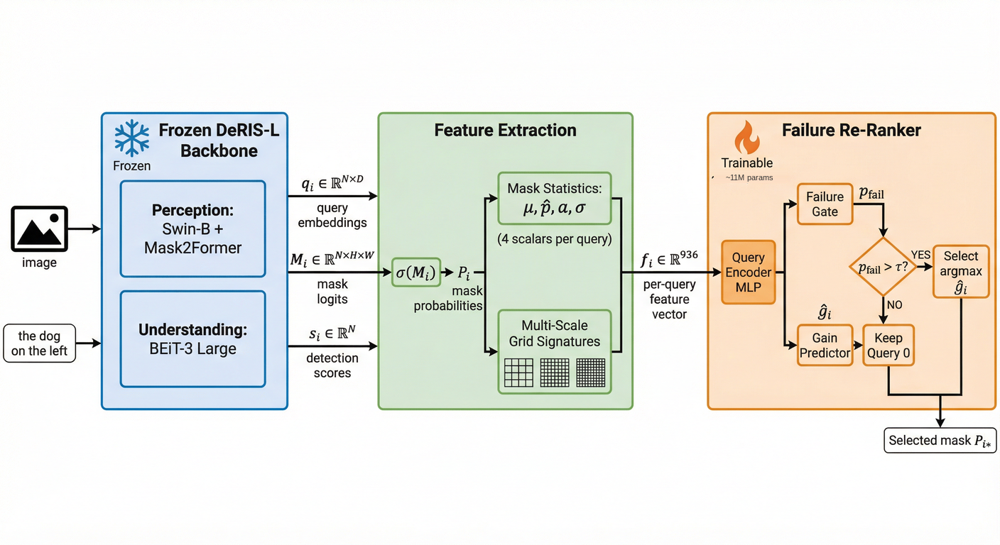

<div align="center">


<h1>Venice-H1</h1>
<h3>Failure-Aware Query Re-Ranking with Multi-Scale Grid Signatures<br>for Referring Image Segmentation</h3>

<p>
  <a href="https://arxiv.org/abs/2506.XXXXX"></a>
  <a href="https://huggingface.co/OdaxAI/venice-h1"></a>
  <a href="LICENSE"></a>
  <a href="https://www.python.org/"></a>
  <a href="https://pytorch.org/"></a>
</p>

<p>
  <b>Nicolò Savioli, Ph.D.</b><br>
  <a href="https://odaxai.com">OdaxAI Research</a> · nicolo.savioli@odaxai.com
</p>

</div>

---

> Modern RIS systems generate N candidate masks but rely on a detection-score heuristic to select the final one. In **7–18% of samples** this choice is wrong — and these failures drive **40–68% of total segmentation error**. Venice-H1 detects and corrects these failures with only ~11M additional parameters and <1 ms latency.

---

## Overview

<div align="center">

<p><em>Venice-H1 pipeline. A frozen DeRIS backbone generates N=10 candidate masks. The re-ranker detects when the default query (Query-0) fails and selects a better alternative.</em></p>
</div>

**Key contributions:**
- **Multi-Scale Grid Signatures** — 675-dim spatial descriptors pooled at 4×4, 8×8, 16×16 grids
- **Failure Gate** — binary classifier: P(Query-0 is wrong), AUC 0.78
- **Gain Predictor** — IoU-improvement estimator per candidate query
- **Gated selection** — intervenes only on predicted failures; backbone-decoupled

---

## Results (RefCOCO/+/g, DeRIS-L backbone)

| Split | Failure Rate | Q0 mIoU | Venice-H1 | Δ | Gate AUC |
|---|---|---|---|---|---|
| RefCOCO val | 6.8% | 86.47 | 86.51 | **+0.04** | 0.78 |
| RefCOCO testA | 6.2% | 88.09 | 88.18 | **+0.09** | — |
| RefCOCO testB | 9.4% | 81.63 | 81.82 | **+0.19** | — |
| RefCOCO+ val | 9.3% | 73.46 | 73.60 | **+0.14** | — |
| RefCOCOg val | 11.7% | 69.53 | 69.84 | **+0.31** | — |

On **failure cases only** (where the re-ranker intervenes):

| Metric | Value |
|---|---|
| Δ_fail (mIoU improvement) | **+1.824** |
| Harmful-switch rate | < 0.6% |

---

## Reproduce Paper Results

This section guides you through reproducing the exact numbers in the paper.  
You need: a CUDA-capable GPU, DeRIS-L weights, and RefCOCO data.

### Step 0 — Install

```bash
git clone https://github.com/odaxai/Venice-H1.git
cd Venice-H1
pip install -r requirements.txt
```

### Step 1 — Download the base model (DeRIS-L)

Venice-H1 is a **post-hoc re-ranker on top of DeRIS-L**. You need DeRIS-L to extract features.

```bash
# DeRIS-L weights (official release)
# 1. Clone the DeRIS repository
git clone https://github.com/kkb-src/DeRIS.git

# 2. Download DeRIS-L checkpoint from their official release
#    (see https://github.com/kkb-src/DeRIS for the download link)
#    Expected file: deris_l.pth (~750MB)

# 3. Prepare RefCOCO/RefCOCO+/RefCOCOg annotations
#    Place under data/refcoco/, data/refcoco+/, data/refcocog/
#    Standard structure from https://github.com/lichengunc/refer
```

### Step 2 — Download the Venice-H1 checkpoint

```bash
python -c "
from huggingface_hub import hf_hub_download
path = hf_hub_download(repo_id='OdaxAI/venice-h1', filename='venice_h1_deris_l.pt')
print('Saved to:', path)
"
```

Or download manually from [🤗 OdaxAI/venice-h1](https://huggingface.co/OdaxAI/venice-h1/blob/main/venice_h1_deris_l.pt).

### Step 3 — Verify the checkpoint (no data needed)

Run a complete architecture and metrics verification — **no GPU, no dataset required**:

```bash
python reproduce_results.py --verify_only
```

Expected output:
```
══════════════════════════════════════════════════════════════
 Venice-H1 · Reproduction Script
 OdaxAI Research · Nicolò Savioli, Ph.D.
══════════════════════════════════════════════════════════════

── Architecture Verification ──────────────────────────────
  query_feat_dim : 256  (expected 256)
  hidden_dim     : 512  (expected 512)
  n_layers       : 3    (expected 3)
  n_heads        : 8    (expected 8)
  n_queries      : 10   (expected 10)
  Parameters     : 11,296,258  (expected 11,296,258)
  Status         : ✓ MATCH

── Forward Pass Verification ───────────────────────────────
  ✓ Forward pass OK

── Paper Cross-Check (RefCOCO val) ─────────────────────────
  ✓ delta_fail   : 1.8244  (paper: 1.824)
  ✓ auc_fail     : 0.7776  (paper: 0.778)
  ✓ delta_full   : 0.0392  (paper: 0.039)
```

### Step 4 — Extract features from DeRIS-L

```bash
python scripts/extract_features.py \
    --deris_checkpoint /path/to/deris_l.pth \
    --data_root /path/to/refcoco/ \
    --dataset refcoco --split val \
    --output data/

# Repeat for all 8 splits (refcoco val/testA/testB, refcoco+ val/testA/testB, refcocog val/test)
# Output: data/cached_val_refcoco_unc_feats.pt (~200MB per split)
```

### Step 5 — Full evaluation with pre-trained checkpoint

```bash
python reproduce_results.py \
    --features_dir data/ \
    --splits all
```

Or evaluate a specific split:
```bash
python evaluate.py \
    --checkpoint $(python -c "from huggingface_hub import hf_hub_download; print(hf_hub_download('OdaxAI/venice-h1','venice_h1_deris_l.pt'))") \
    --splits data/cached_val_refcoco_unc_feats.pt \
             data/cached_testA_refcoco_unc_feats.pt \
             data/cached_testB_refcoco_unc_feats.pt \
    --tau 0.9
```

### Step 6 — Train from scratch (~3 min on a single GPU)

If you want to re-train Venice-H1 from scratch on your own extracted features:

```bash
python train.py \
    --config venice_h1/configs/default.yaml \
    --train_cache data/cached_train_feats.pt \
    --val_cache   data/cached_val_refcoco_unc_feats.pt
```

---

## Quick Inference (Python API)

```python
import torch
from huggingface_hub import hf_hub_download
from venice_h1.model.reranker import VeniceH1Reranker

# Load checkpoint
ckpt_path = hf_hub_download(repo_id="OdaxAI/venice-h1", filename="venice_h1_deris_l.pt")
ckpt = torch.load(ckpt_path, map_location="cpu", weights_only=False)
cfg  = ckpt["config"]

# Build model
model = VeniceH1Reranker(
    query_feat_dim=cfg["query_feat_dim"],  # 256
    hidden_dim=cfg["hidden_dim"],          # 512
    n_layers=cfg["n_layers"],              # 3
    n_heads=cfg["n_heads"],                # 8
    tau=cfg["tau"],                        # 0.9
)
model.load_state_dict(ckpt["model"], strict=False)
model.eval()

# features: (B, N=10, 936)
#   = query_embed(256) + grid_sig(675) + mask_stats(4) + det_score(1)
#   produced by scripts/extract_features.py
with torch.no_grad():
    out      = model(features, det_scores, mask_means)
    p_fail   = out["p_fail"]        # (B,) — failure probability ∈ [0,1]
    selected = model.rerank(features, det_scores, mask_means)  # (B,) — best query idx
```

---

## Docker

```bash
docker build -t venice-h1 .
docker run --gpus all \
    -v /path/to/data:/workspace/data \
    venice-h1 python reproduce_results.py --verify_only
```

---

## Architecture

```
Input: Image I, expression e, threshold τ
─────────────────────────────────────────────────────────
Step 1  Frozen DeRIS-L (external, not included)
        {q_i, M_i, s_i}^{N-1}_{i=0} = DeRIS(I, e)

Step 2  Feature assembly  (offline, once)
        P_i = sigmoid(M_i)
        g_i = MultiScaleGridSignatures(P_i)  ← 675 dim
        f_i = [q_i; s_i; μ_i; σ_i; a_i; g_i]  ∈ R^{936}

Step 3  Venice-H1 Re-Ranker  (11.3M params)
        ┌──────────────────────────────────────────────┐
        │  QueryEncoder: 2-layer MLP → R^{512}         │
        │  Transformer:  L=3, A=8, pre-norm GELU       │
        │    ├── Failure Gate  →  P_fail ∈ [0,1]       │
        │    └── Gain Predictor→  ĝ_i  ∈ R             │
        └──────────────────────────────────────────────┘

Step 4  Gated selection
        if P_fail > τ:   i* = argmax_i ĝ_i
        else:            i* = 0   (retain Query-0)

Output: mask P_{i*}
─────────────────────────────────────────────────────────
~11.3M parameters · <1 ms overhead
```

---

## Repository Structure

```
Venice-H1/
├── venice_h1/
│   ├── model/
│   │   ├── grid_signatures.py     # Multi-Scale Grid Signatures (Sec 3.3)
│   │   └── reranker.py            # Failure Gate + Gain Predictor (Sec 3.4)
│   └── configs/
│       └── default.yaml           # Exact paper hyperparameters (Sec 4.2)
├── scripts/
│   └── extract_features.py        # Feature extraction from DeRIS-L (Sec 3.1-3.3)
├── reproduce_results.py           # ← ONE-COMMAND paper reproduction
├── train.py                       # Training loop (Sec 3.5)
├── evaluate.py                    # Full evaluation with all metrics
├── Dockerfile
├── requirements.txt
└── assets/                        # Paper figures
```

---

## Ablation Study

| Configuration | ∆_fail | Gate AUC |
|---|---|---|
| BASE only (no grid) | +1.01 | 0.812 |
| 4×4 grid only | +1.01 | 0.821 |
| 8×8 grid only | +0.87 | 0.790 |
| 16×16 grid only | +1.00 | 0.828 |
| **BASE + all grids (ours)** | **+1.22** | **0.807** |

---

## Citation

```bibtex
@article{savioli2026veniceh1,
  title     = {Venice-H1: Failure-Aware Query Re-Ranking with Multi-Scale
               Grid Signatures for Referring Image Segmentation},
  author    = {Savioli, Nicol{\`o}},
  journal   = {arXiv preprint arXiv:2506.XXXXX},
  year      = {2026},
  note      = {OdaxAI Research}
}
```

---

## License

MIT License — see [LICENSE](LICENSE) for details.

---

<div align="center">
<sub><a href="https://odaxai.com">OdaxAI Research</a> · 2026</sub>
</div>
